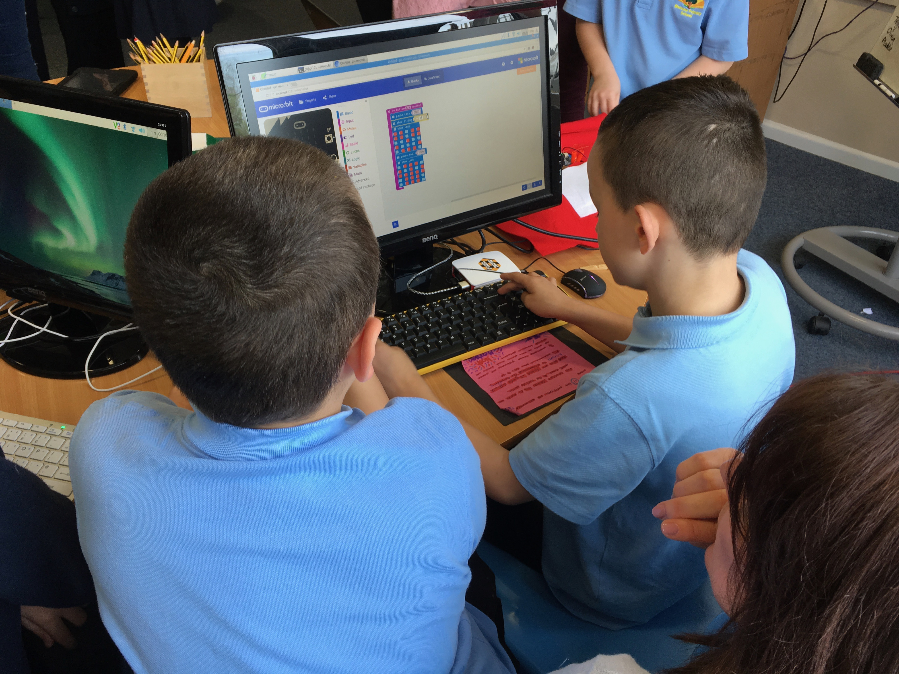

# Monnow-LCS notes

## Background

These notes describe the computing resources used in the sessions (6 for students, 1 for teacher development).

The documents are provided in PDF format, but the source documents used to create the PDFs are written in [Markdown](https://daringfireball.net/projects/markdown/) — a plain text markup format. You can get the meaning of the file in a plain text editor (eg Notepad-Windows), but to regnerate the full formatting, use a Markdown editor such as [Texts](http://www.texts.io/features/) on Windows, or one of the myriad of equivalents on macOS/iOS eg [Byword](https://bywordapp.com).
The slide sets were also generated from Markdown (PDFs provided).

The license file attached to the documents is the [MIT license](https://choosealicense.com/licenses/mit/) which basically allows any non-commercial or commercial use of the material provided these rights are retained for others. 

## Original concepts

The original concept was a strongly mobile-robotics centred one, which in full did not survive the initial planning sessions, but many of the underlying ideas did:

- exploring different kinds of sensors
- programming as a means of thinking about the world
- acting on the world with sounds, light

See my original thoughts document:

[Thoughts](files/Paper-1.pdf)

## Sessions

### Session 1

This session introduced the notions of 'Sense', 'Think', 'Act' to be used in creating creatures which can interact with the world.

 

There were three activities:

- [Activity 1 (Act-light LEDs)](session%201/Activitity%201-Sense,%20Act.pdf) There'd been a quick intro. to what the Racket programming language looks like; students typed pre-defined commands into a Raspberry Pi to flash leds, use a PIR sensor (like a garage light sensor) to sense movement, and put the two togther to create a 'burglar alarm'.
- [Activity 2 (Sense-measure temperature)](session%201/Activity%202%20(Sense%E2%80%94measure%20temperature).pdf) A temperature probe on a Raspberry Pi was used to create a table of temperatures against time for a mug of warm water. We also tested the radiator temperatures in the room.
- [Activity 3 (Think-human robots)](session%201/Activity%203%20(Think%E2%80%94human%20robots).pdf) In this activity, one student pretends to be a robot, and another is the program which controls the robot. The students learned how surprisingly tricky it is to program a route for a robot. They also observed an autonomous Ras. Pi robot and tried to guess what rules it was obeying as it moved around the room.

### Session 2

We had a brief presentation at the beginning of the session to introduce working with microbits, and as with some other sessions showed a 'computing pioneer', Margaret Hamilton.

Two activities:

- [Activity 4-microbits talking](session%202/Activity%204.pdf) Introduces the idea that microbit can communicate over a built-in (Bluetooth) wireless network. We displayed the network activity of a couple of microbits on a central display. This enabled us to split the classroom into a grid and make a map of temperature and Bluetooth signal across the room.
- [Activity 5-Sonic Pi](session%202/Activity%205.pdf) We explored the possibilities of turning data into sound, for example in [hearing the weather](http://somenotes.stevelloyd.net/notes/2014/06/23/hearing-the-weather-sonification-in-sonic-pi/) resulting in [these sounds](http://somenotes.stevelloyd.net/resources/temperature.mp3) (in the event we used the sound generation of the microbits themselves, but knowledge of Sonic Pi is a great skill to have anyway).

### Session 3

We started off with a reflection on the previous week's activity and then introduced the [pxt](https://pxt.microbit.org) block JavaScript programming language). 

The 'pioneer' was Alan Kay, whose team at the Xerox Palo Alto Research Centre invented desktop computing as we know it (incidentally to investigate the teaching of programming in school).

[Slides](session%203/session3-intro.pdf)

Activity:

[Activity 6-try some blocks](session%203/Activity%206.pdf)

### Session 4

Students got their hands on their microbits, were introduced to the notion that each microbit has a unique 'name' burned into its software (which can be used to identify data from each microbit in a wireless network). They used a pre-programmed microbit program to wire up external LEDs to their microbits.

The 'pioneers' were students participating in the code.org supported [Bootstrap](http://www.bootstrapworld.org) programme using the Racket language in a maths-supporting computing curriculum.
 

[Slides](session%204/session4-intro.pdf)

### Session 5

After a recap students continued to work on their thunkpets and saw how they might write stories to support their programming ideas.

Time constraints meant we didn't get chance to show the 'pioneers' film which was on the theme of Bret Victor's ["What can a techologist do about Climate Change](http://worrydream.com/#!/ClimateChange).

[Slides](session%205/session5-intro.pdf)

### Session 6

In this session there was busy final preparation for the parent's presentation, and programming of the final applications into the thunkpets. 

### Teacher session

We based the session on the students' pxt programming session; a hands-on exploration of physical computing, and discussion on how microbits could be used in curriculum relevant to the teachers involved-there were lots of ideas.

[Slides](session%207/session7-intro.pdf)

[Activity (used purely as a starting point)](session%207/Activity-programming%20microbit%20with%20pxt.pdf)