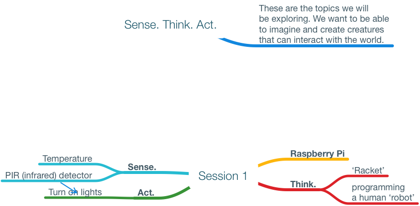

# Monnow-LCS notes

## Background

These notes describe the computing resources used in the sessions (6 for students, 1 for teacher development) and the ways in which the project creatively evolved as a pragmatic discourse between SL, RT, KMS, staff and particularly the students.

The document is written in [Markdown](https://daringfireball.net/projects/markdown/) — a plain text markup format. You can get the meaning of the file in a plain text editor (eg Notepad-Windows), but to get the full formatting, use a Markdown editor such as [Texts](http://www.texts.io/features/) on Windows, or one of the myriad of equivalents on macOS/iOS eg [Byword](https://bywordapp.com). There is a PDF equivalent provided also.

## Original concepts

The original concept was a strongly mobile-robotics centred one, which in full did not survive the initial planning sessions, but many of the underlying ideas did:

- exploring different kinds of sensors
- programming as a means of thinking about the world
- acting on the world with sounds, light

See my original thoughts document:

[Thoughts](files/Paper-1.pdf)

## Sessions

### Session 1

This session introduced the notions of 'Sense', 'Think', 'Act' to be used in creating creatures which can interact with the world.

 

There were three activities:

- [Activity 1 (Act-light LEDs)](session%201/Activitity%201-Sense,%20Act.pdf) There'd been a quick intro. to what the Racket programming language looks like; students typed pre-defined commands into a Raspberry Pi to flash leds, use a PIR sensor (like a garage light sensor) to sense movement, and put the two togther to create a 'burglar alarm'.
- [Activity 2 (Sense-measure temperature)](session%201/Activity%202%20(Sense%E2%80%94measure%20temperature).pdf) A temperature probe on a Raspberry Pi was used to create a table of temperatures against time for a mug of warm water. We also tested the radiator temperatures in the room.
- [Activity 3 (Think-human robots)](session%201/Activity%203%20(Think%E2%80%94human%20robots).pdf) In this activity, one student pretends to be a robot, and another is the program which controls the robot. The students learned how surprisingly tricky it is to program a route for a robot. They also observed an autonomous Ras. Pi robot and tried to guess what rules it was obeying as it moved around the room.

