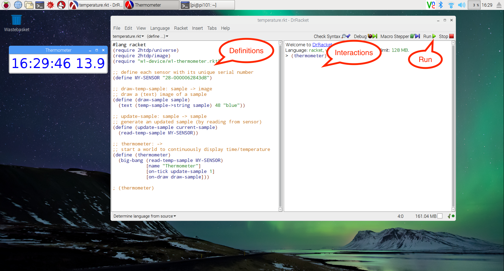

# Activity 2 (Sense—measure temperature)

This activity is to show how you can:
-  sense and display the temperature
Find the Raspberry Pi with a temperature probe. On the screen should be a Racket language display.

You've already got some definitions provided. Make sure they're ready by pressing the *run* button. 
There is just one function for you to call *(thermometer)*, by typing it into the *interactions* window.
When you do this, can you work out what the displayed numbers are?
Try holding the temperature probe, what happens? If you can get a cup of warm water from a tap, you can try another experiment. Draw a table like the one below

| Reading number | Time | Temperature |
| -------------- | ---- | ----------- |
| 1              |      |             |
| 2              |      |             |
| 3              |      |             |
| 4              |      |             |
| ... (add rows) |      |             |

Put the sensor into the warm water (it's waterproof, but keep water away from the Pi itself!).  Now each 30 seconds, write down the time and temperature. What do you see? If you were thinking about doing this experiment repeatedly, can you suggest any improvements?
