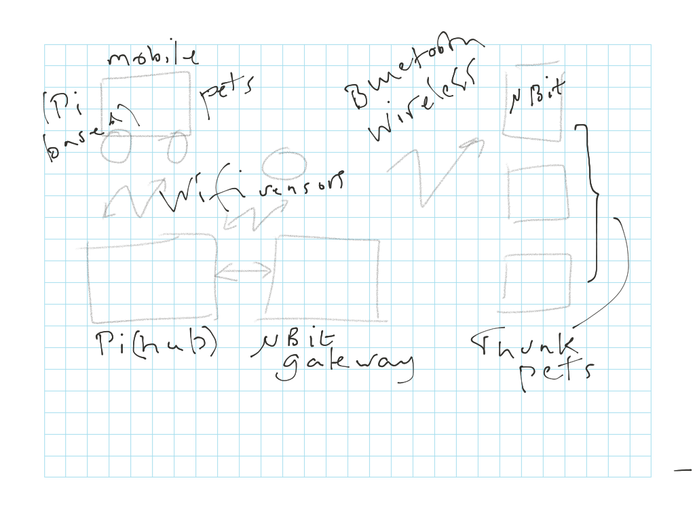
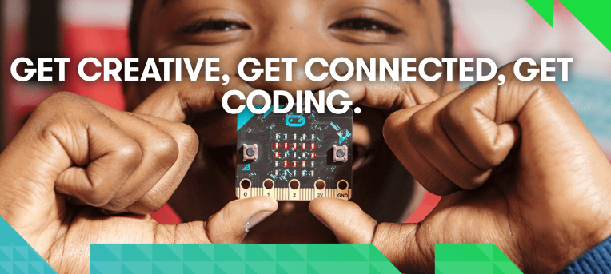

# The pets' electronics

---

---

# microbit

- small and low power—can be sewn into your pet
- it's got a 5 x 5 display
- two buttons
- temp, light, compass, acceleration sensors
- can add a sounder

Image: BBC

---

# Raspberry Pi

- Hub for pet communication
- control the mobile pets
- generating ambient sounds
- hub for sensors

---

# today's video

Margaret Hamilton, computing pioneer

... just awarded the Presidential medal of freedom by barack obama

led the team who built the software for the apollo guidance computer 
(1/10 memory of the microbit, weighed 32KG, cost £100,000)

---

---

