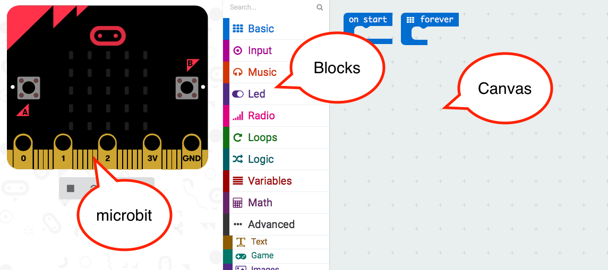
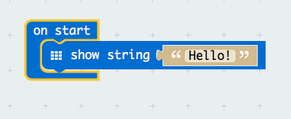

## Activity 6—(Think.) - try some blocks

Open microbit pxt by browsing to pxt.microbit.org

Use the **Basic** block set and build this to show a message

Try changing the message.

If you hover the mouse over a block what happens?

Now look at the *show icon* block, and display a diamond, then add a *pause* for 1 second (what number will you use for the time to pause?).
Now after this display a square and another *pause*.
Put this sequence into a *forever* loop.

Look at the **Input** block set.
Can you make a program which displays one message (or icon) when you press button *A* and another when you press button *B*?

Try making a program which normally shows a sequence of icons, but if button *A* is pressed, shows the temperature for 5 seconds. (Hint: you can have two sets of blocks, and they will work independently).

Now think of some behaviours which you could make for your pet with these sorts of blocks, and write down your ideas as a story. An example might be:

"My pet shows one icon when it is happy, and another when it is sad. Normally its happy, but if I press button A it is sad for 10 seconds"
