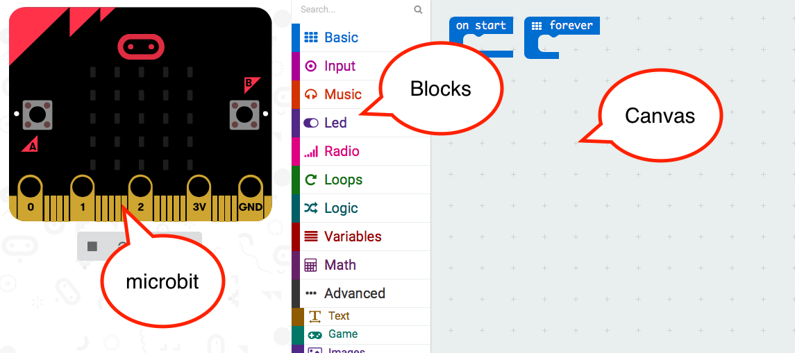
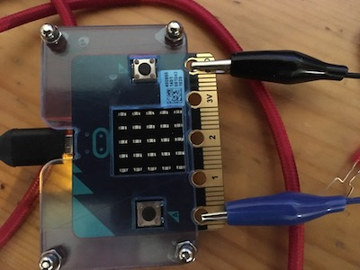

# Activity—programming microbit with pxt

## using blocks

Open microbit pxt by browsing to pxt.microbit.org (on an internet-connected device)

Use the **Basic** block set and build this to show a message

Try changing the message.

If you hover the mouse over a block what happens?

Now look at the *show icon* block, and display an icon of your choice, then add a *pause* for 1 second (what number will you use for the time to pause?).
Now after this display a different icon and another *pause*.
Put this sequence into a *forever* loop.

What do you think is the difference between *on start* and *forever*?

Look at the **Input** block set.
Can you make a program which displays one message (or icon) when you press button *A* and another when you press button *B*?

Try making a program which normally shows a sequence of icons, but if button *A* is pressed, shows the temperature for 5 seconds. (Hint: you can have two sets of blocks, and they will work independently).

## Physical computing

Wire up the sounder as in the photo, taking care not to create a short-circuit between adjacent copper tracks. Now look at the *music* block set and see if you can set a *middle C* to be played when button B is pressed.
