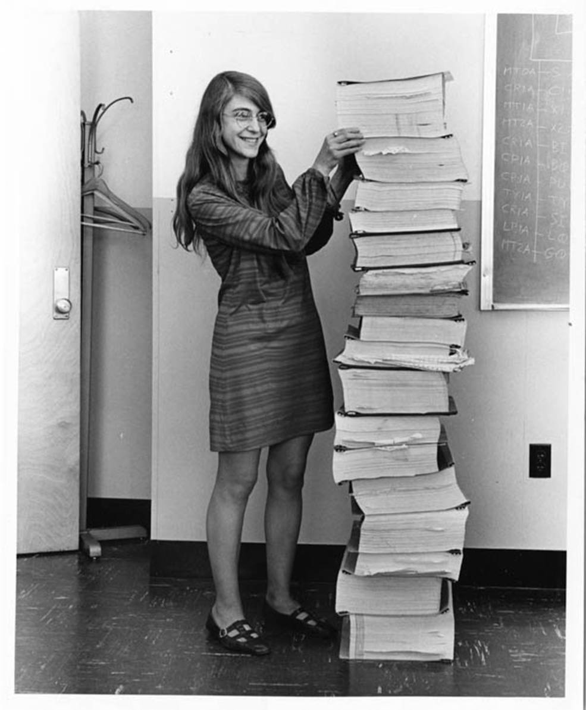

autoscale: true

# We explored

---

# Raspberry Pi 

---

# BBC microbit

---

# Background on some pioneering computing developers, like Margaret Hamilton

---

---

# Making circuits with LEDs

---

# Sensors

---

# Programming
## Microsoft pxt
## Sonic Pi
## Racket

---

# https://github.com/stevelloyd/Monnow-LCS

---